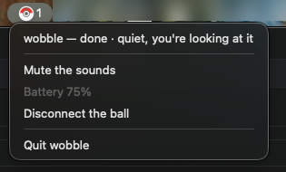
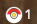
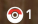

# wobble

A Poké Ball Plus that tells you when Claude Code is done, or when it is stuck waiting on you.

Leave the agent working and walk away with the ball in your hand. When a session finishes, the
ball lights up yellow and Pikachu cries. When a session asks you something, the ball wobbles
in your hand like a catch in progress, and keeps wobbling until you deal with it. Press the ball's
button and the window that was waiting comes to the front.

No ball? It still works: the menu bar shows what is waiting and the Mac makes the sounds.

<p align="center">
  
</p>

> **Unofficial fan project.** Not affiliated with, endorsed by or connected to Nintendo,
> Creatures Inc., GAME FREAK inc. or The Pokémon Company. Free, non-commercial, and it stays that
> way. No Nintendo asset is in this repository: the Pikachu cry is downloaded onto your own Mac at
> install time. Details in [NOTICE.md](NOTICE.md).

## What you need

| | |
|---|---|
| **A Mac** | macOS only, for now. Built and checked on macOS 26 with Apple silicon |
| **[Claude Code](https://claude.com/claude-code)** | in a terminal, in VS Code, or in the Claude desktop app's Code tab |
| **Python 3.12** | `brew install python@3.12`. The `python3` that ships with macOS is too old |
| **ffmpeg** *(optional)* | `brew install ffmpeg`, to convert the Pikachu cry. Without it the ball plays its built-in sounds only |
| **A Poké Ball Plus** *(optional)* | the accessory made for *Pokémon: Let's Go* on the Switch. wobble works without one |

No Homebrew? Get it from [brew.sh](https://brew.sh) first.

## Install

```bash
git clone https://github.com/tinyquestlab/wobble.git
cd wobble
./install.sh
```

`install.sh` does four things, and you can run it again at any time:

1. Creates a Python environment in `venv/` and installs four libraries into it (`requirements.txt`).
2. Downloads Pikachu's cry and converts it into the ball's format (`tools/fetch_cry.py`).
3. Shows the Claude Code hooks it wants to add to `~/.claude/settings.json`, and asks before
   writing them. A hook is how Claude Code tells wobble that a session finished or is waiting.
   It never touches a hook that is not its own, and it backs the file up first.
4. Says how to start wobble.

**Restart Claude Code afterwards.** It reads hooks only when a session starts.

## Start it

From a terminal, in the `wobble` folder:

```bash
venv/bin/python3 -m src.daemon
```

A small ball appears in the menu bar. Leave the terminal open: wobble runs as long as it does.
To stop it, press **Ctrl-C** (not Ctrl-Z, which leaves the ball's connection stuck open).

Or build it as an app you can keep in the Dock and start like any other:

```bash
venv/bin/python3 tools/build_app.py --install     # creates /Applications/wobble.app
```

This needs Apple's command line tools (`xcode-select --install`). The app runs the code in this
folder, so do not move the folder afterwards, or build the app again if you do.

**Run one wobble at a time.** A second one refuses to start while the first is running. Quit the
app before starting one from a terminal, and the other way round.

## Connect the ball

1. Start wobble.
2. **Press the ball's top button.** The ball sleeps quickly to save its battery and is only
   visible over Bluetooth for a few seconds after a press.
3. The ball ticks once, and the menu bar's ball flashes white and fills in. That is the link.

There is no pairing step, no code, and nothing to set up in the Mac's Bluetooth settings. If the
ball goes out of range or to sleep, press its top button again and wobble picks it back up.

The ball talks to one device at a time. While wobble holds it, a Switch cannot, and the other way
round.

## Allow it on the Mac

macOS asks for two permissions. Both are in **System Settings › Privacy & Security**.

| Permission | What wobble uses it for | Without it |
|---|---|---|
| **Bluetooth** | talking to the ball | the menu bar and the Mac's sounds still work |
| **Accessibility** | reading window titles, to know which session you are looking at, and bringing a window to the front | the button still quiets the ball, but no window comes forward, and wobble may signal while you are already looking |

Started from a terminal, the permissions belong to the terminal app (Terminal, Warp, VS Code),
so that is the app to switch on in the list. Started as `wobble.app`, they belong to wobble.

## What it tells you

| What happened | On the ball | On the Mac, with no ball |
|---|---|---|
| **A session finished** | the ring lights Pikachu-yellow and stays lit; Pikachu cries with a light buzz, and once more after 30 s | the Pikachu cry |
| **A session is waiting on you** (a permission prompt, a question) | a wobble every 1.5 s, until you deal with it | a short wobble every 1.5 s |
| **You answered it** | green, with the catch sound | the catch's click |
| **You went to it and left without answering** | red: it broke out, and keeps asking | a low "no" |
| **You silenced a session** (hold the button) | blue, and a weak tick | nothing |

A waiting question always goes ahead of a finished session. On a newer ball, Pikachu's cry
changes with what happened: happy, proud after a long turn, sad after an error, lonely when nobody
comes.

**When it stays quiet on purpose:**

- while you are already looking at that session's window (it speaks 3 s after you look away);
- for 5 s after you type a prompt anywhere, so a sound is never mistaken for your own keystroke;
- for 3 s after you close a session, so the next sound is not mistaken for the one that closed.

Every number above lives in [`config/signals.json`](config/signals.json) and can be changed
there without touching code.

## The button

The ball's top button is the only control.

| | |
|---|---|
| **Press** | the top signal goes quiet and its window comes to the front. If you do not answer it, it comes back after 5 minutes: a press means "seen, I'll get to it", never "forget it" |
| **Press again** | skip to the next waiting session; the one you skipped goes to the back of the queue |
| **Hold for 2 s** | silence that session until you type in it again |

Typing a prompt in a session clears whatever it had waiting: you were there.

With no ball, **right-click** the menu bar ball, or press **Enter** in the terminal running wobble.
Both do exactly what a press does.

## The menu bar

The ball in the menu bar mirrors the real one: its centre shows the same light, and the number
beside it is how many sessions are waiting.

| The menu bar's ball | means |
|---|---|
| bottom half filled | connected; the red top half is the battery left |
| hollow | looking for the ball (press its top button) |
| faded | the ball is switched off from the menu, or wobble was started with `--no-ball` |

| | |
|---|---|
|  | a session finished: the centre is lit yellow, like the real ball's ring |
|  | the same session while you are looking at its window: still counted, but quiet and dark |

Click it for the menu: every waiting session (click one to go to it; hold **⌥** to silence it
instead), **Mute the sounds** (the ball still buzzes and lights), connect or disconnect the ball,
and **Quit wobble**.

## Running with no ball

```bash
venv/bin/python3 -m src.daemon --no-ball
```

wobble never looks for a ball: the menu bar and the Mac's sounds do everything. This is also
how wobble is developed. `--help` lists the other options, such as `--mute`.

## Your own sounds

The Mac's sounds can be your own. Put a file in `assets/sounds/`, named after what it plays for,
and start wobble again:

| File | Plays when |
|---|---|
| `needs` | a session is waiting on you, every 1.5 s, so keep it short |
| `done` | a session finished |
| `caught` | you answered it |
| `broke_out` | you went to it and left without answering |

Any of `.wav`, `.aiff`, `.m4a`, `.mp3` or `.caf`, for example `assets/sounds/needs.mp3`. wobble
says at start which ones it found, and names any file it will not play. Git ignores the folder, so
your sounds stay on your Mac.

**They are for the Mac only.** The ball always plays its own effects and a Pokémon's cry, never a
file you add. The sounds wobble ships in [`sounds/`](sounds/README.md) were drawn in code, and
contain no audio from the game.

## Uninstall

```bash
venv/bin/python3 tools/install_hooks.py --uninstall   # takes wobble's hooks back out
rm -rf /Applications/wobble.app                       # if you built the app
```

Then delete the `wobble` folder, and remove wobble or your terminal from **Accessibility** and
**Bluetooth** in System Settings if you want those back as they were. The ball keeps the cry and
the yellow light wobble sent it until a Switch writes its own.

## Troubleshooting

| | |
|---|---|
| **Nothing happens when a session finishes** | restart Claude Code after installing: hooks load when a session starts. wobble also says it in its own output when no hooks are wired |
| **A session in the Claude desktop app never signals** | only the Code tab, run on this Mac (Local), loads Claude Code's hooks |
| **The ball never connects** | press its top button while wobble is running. Check that no Switch and no other wobble holds it, and that Bluetooth is allowed |
| **The ball buzzes but plays no cry** | run `venv/bin/python3 tools/fetch_cry.py`. It needs ffmpeg |
| **The button quiets the ball but no window comes forward** | allow Accessibility for the app wobble runs in, then restart wobble |
| **"another wobble daemon is already running"** | quit the app, or the other terminal, first |
| **The ball's light stays on after wobble quits** | normal: a light the ball holds is only turned off by a command. Start wobble and quit it from the menu |

wobble writes what it does, one file per day, in `var/logs/`. That is the first place to look.

## How it works

- [docs/HOW-THE-BALL-WORKS.md](docs/HOW-THE-BALL-WORKS.md): the ball and Bluetooth in plain
  language. Start here if you want to drive the ball from your own code.
- [docs/PROTOCOL.md](docs/PROTOCOL.md): everything known about the ball's protocol, byte by byte,
  and how each fact was found.
- [constitution.md](constitution.md): what wobble is, and what it refuses to become.
- [ROADMAP.md](ROADMAP.md): what comes after this first version.
- [docs/DESK-CHECKS.md](docs/DESK-CHECKS.md): how a change is verified, by hand, with the ball.
- [specs/01-mvp/](specs/01-mvp/): how this first version was specified, planned and built.

## Credits and licence

The source code is under the [PolyForm Noncommercial License 1.0.0](LICENSE): free to use, study,
change and share for any non-commercial purpose. The earlier public work this builds on is
credited in [NOTICE.md](NOTICE.md).

If a rights holder wants any part of this taken down, open an issue and it comes down.
